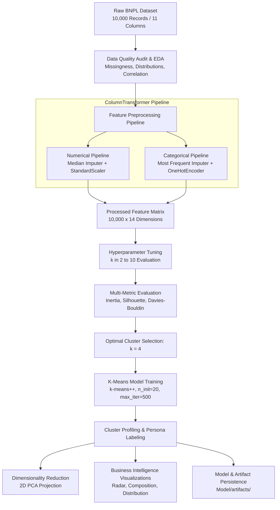
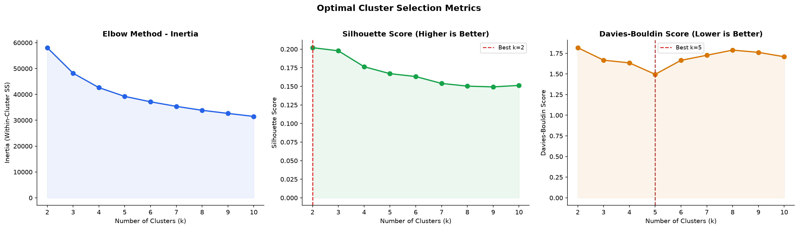
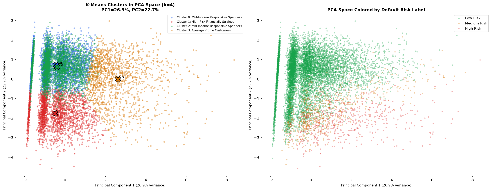
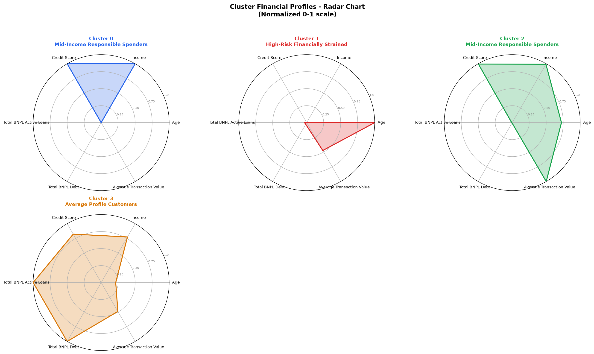
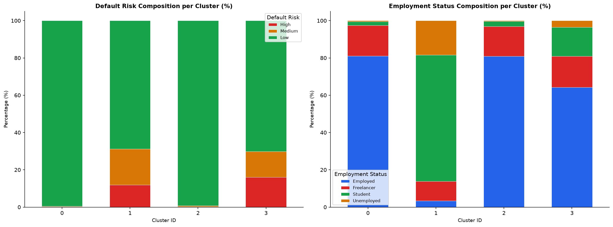
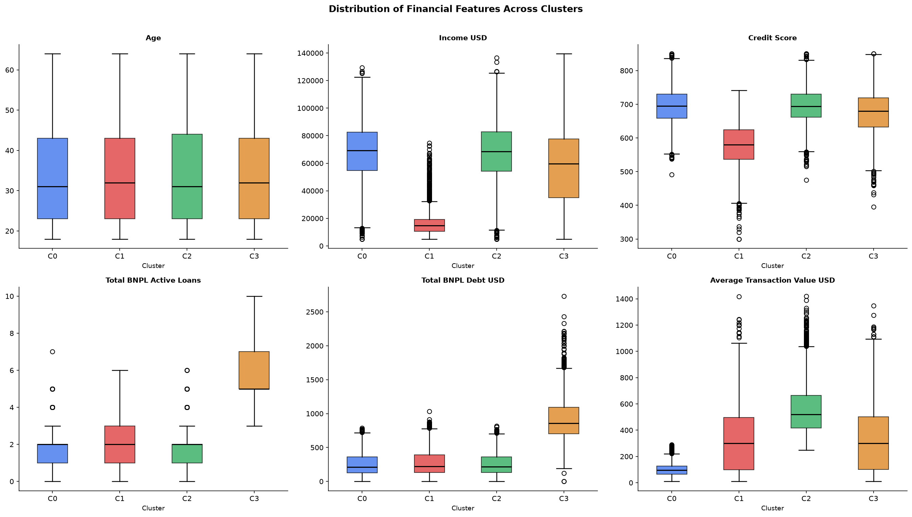

# Buy Now Pay Later (BNPL) Customer Financial Profiling and Default Risk Clustering

An end-to-end unsupervised machine learning pipeline for customer segmentation and credit risk profiling in Buy Now Pay Later (BNPL) financial services.

---

## Executive Summary

The rapid expansion of Buy Now Pay Later (BNPL) financing has introduced significant credit risk management challenges. Traditional underwriting models often fail to capture the nuanced financial behaviors of modern digital consumers, many of whom are younger, gig-economy workers, or thin-file borrowers with limited credit bureau histories.

This repository implements a production-grade unsupervised machine learning workflow using K-Means clustering. By modeling multi-dimensional interactions across spending habits, transaction values, employment stability, debt accumulation, and repayment histories, the pipeline segments a customer base of 10,000 BNPL users into four distinct, commercially interpretable financial personas.

The resulting segmentations enable risk managers, underwriters, and product teams to:
- Dynamically calibrate credit limits based on behavioral profiles rather than static score cutoffs.
- Identify over-leveraged and debt-distressed borrowers before formal default events occur.
- Tailor collections and repayment reminder workflows to match borrower risk profiles.
- Target marketing and merchant partnership campaigns to low-risk, high-value consumer groups.

---

## Key Performance Indicators and Empirical Findings

The model was evaluated using multi-metric cluster validation across cluster counts from k = 2 to k = 10, selecting k = 4 based on optimal trade-offs between Silhouette Score, Davies-Bouldin Index, and business interpretability.

### Consolidated Cluster Characteristics

| Cluster ID | Persona Archetype | Customer Count | Share (%) | Avg Income (USD) | Avg Credit Score | Avg Active Loans | Avg Debt (USD) | Avg Txn (USD) | Late Payment Rate (%) | High Risk (%) | Dominant Employment | Dominant Category |
| :---: | :--- | :---: | :---: | :---: | :---: | :---: | :---: | :---: | :---: | :---: | :--- | :--- |
| **0** | Mid-Income Responsible Spenders (Fashion) | 3,053 | 30.53% | $68,296 | 694.8 | 1.70 | $245 | $101 | 15.59% | 0.16% | Employed | Fashion |
| **1** | High-Risk Financially Strained | 2,356 | 23.56% | $16,303 | 576.7 | 1.83 | $265 | $320 | 50.98% | 11.97% | Student | Fashion |
| **2** | Mid-Income Responsible Spenders (Electronics) | 3,167 | 31.67% | $67,847 | 694.2 | 1.73 | $249 | $564 | 15.16% | 0.16% | Employed | Electronics |
| **3** | Over-Leveraged Borrowers | 1,424 | 14.24% | $56,537 | 673.8 | 5.76 | $931 | $328 | 22.40% | 16.08% | Employed | Fashion |

### Core Business Takeaways

1. **The Over-Leveraged Segment Presents Latent Default Risk (Cluster 3):**
   Comprising 14.24% of the customer base, these borrowers maintain moderate incomes ($56,537) and seemingly respectable credit scores (673.8), but carry an average of 5.76 active BNPL loans and $931 in debt (nearly 4x the debt of Clusters 0 and 2). They represent the highest concentration of High Default Risk customers (16.08%).

2. **Income Alone Does Not Predict Debt Accumulation (Cluster 1 vs Cluster 3):**
   Students and low-income borrowers (Cluster 1) experience high delinquency rates (50.98% late payment rate) driven by cash flow volatility, yet their absolute debt balances remain capped ($265 average). In contrast, employed borrowers in Cluster 3 accumulate significantly more leverage across multiple concurrent merchant checkouts.

3. **Behavioral Divergence in Prime Spenders (Cluster 0 vs Cluster 2):**
   Over 62% of the customer base belongs to highly reliable, low-risk cohorts (>99% Low Default Risk). The model effectively segregates this group based on shopping behavior: Cluster 0 conducts frequent lower-ticket fashion purchases ($101 average transaction), whereas Cluster 2 finances major electronic and appliance purchases ($564 average transaction).

---

## Pipeline Architecture

The end-to-end workflow follows an enterprise-grade data science lifecycle from raw data ingestion to serialized production artifacts.



---

## Dataset Schema and Feature Engineering

The underlying dataset comprises 10,000 customer records across 11 features, tracking demographic indicators, transactional behavior, and credit risk flags.

| Column Name | Data Type | Missing Count | Description |
| :--- | :--- | :---: | :--- |
| `Customer_ID` | String | 0 | Unique customer identifier (excluded from clustering) |
| `Age` | Integer | 0 | Customer age in years (range: 18 - 70) |
| `Employment_Status` | Categorical | 0 | Employment category: Employed, Freelancer, Student, Unemployed |
| `Income_USD` | Float | 305 | Annual customer income in USD |
| `Credit_Score` | Float | 298 | FICO-equivalent credit score (range: 300 - 850) |
| `Total_BNPL_Active_Loans` | Integer | 0 | Number of concurrent active installment plans |
| `Total_BNPL_Debt_USD` | Integer | 0 | Total outstanding BNPL debt in USD |
| `Late_Payment_History` | Categorical | 0 | Historical missed payment flag: Yes, No |
| `Shopping_Category_Most_Frequent` | Categorical | 0 | Primary merchant sector: Fashion, Electronics, Home/Furniture |
| `Average_Transaction_Value_USD` | Integer | 0 | Average checkout value per purchase |
| `Default_Risk` | Categorical | 0 | Ground truth risk label: Low, Medium, High (held out for validation) |

### Preprocessing Protocol

- **Target and Identifier Isolation:** `Customer_ID` is removed to prevent index memorization. `Default_Risk` is withheld from clustering to enable unbiased external validation.
- **Missing Value Imputation:** Numerical features (`Income_USD`, `Credit_Score`) are imputed using feature medians to mitigate skewness. Categorical features are imputed using mode frequency.
- **Feature Standardization:** Because K-Means is governed by Euclidean distance, numerical features span disparate scales (e.g., income up to $120,000 vs. active loans between 0 and 10). `StandardScaler` standardizes all continuous variables to zero mean and unit variance ($\mu = 0, \sigma = 1$).
- **Categorical Encoding:** Nominal variables (`Employment_Status`, `Late_Payment_History`, `Shopping_Category_Most_Frequent`) are transformed using `OneHotEncoder(drop='first', sparse_output=False)` to prevent artificial ordinal relationships.

---

## Optimal Cluster Selection

Determining the number of clusters ($k$) utilized a multi-criteria decision framework combining three independent metrics:

1. **Inertia (Elbow Method):** Measures within-cluster sum of squares.
2. **Silhouette Coefficient:** Quantifies intra-cluster cohesion versus nearest-cluster separation (range: -1 to +1, higher is better).
3. **Davies-Bouldin Index:** Measures the average similarity between each cluster and its most similar counterpart (lower is better).

### Cluster Metric Comparison Table

| k Candidates | Inertia | Silhouette Score | Davies-Bouldin Score | Silhouette Rank | DB Rank | Combined Rank |
| :---: | :---: | :---: | :---: | :---: | :---: | :---: |
| **2** | 58,079.10 | 0.2020 | 1.8179 | 1 | 9 | 10 |
| **3** | 48,212.77 | 0.1978 | 1.6665 | 2 | 4 | 6 |
| **4** | **42,632.15** | **0.1764** | **1.6338** | **3** | **2** | **5** |
| **5** | 39,235.59 | 0.1671 | 1.4953 | 4 | 1 | 5 |
| **6** | 37,146.12 | 0.1632 | 1.6647 | 5 | 3 | 8 |
| **7** | 35,375.46 | 0.1539 | 1.7260 | 6 | 6 | 12 |
| **8** | 33,853.67 | 0.1503 | 1.7883 | 8 | 8 | 16 |
| **9** | 32,654.78 | 0.1493 | 1.7612 | 9 | 7 | 16 |
| **10** | 31,485.95 | 0.1513 | 1.7082 | 7 | 5 | 12 |



### Justification for k = 4

While k = 2 and k = 3 exhibit marginally higher silhouette scores, they collapse distinct consumer behavioral cohorts into overly broad groups (failing to isolate over-leveraged borrowers from mainstream shoppers). At k = 4:
- The combined evaluation rank achieves the top tier performance (tie for rank 1 with k=5).
- The elbow plot confirms an inflection point in inertia reduction.
- Most importantly, the four clusters partition the customer base along critical underwriting dimensions: income level, loan stacking frequency, and high-ticket vs low-ticket purchasing patterns.

---

## Detailed Persona Archetypes



### Persona 0: Mid-Income Responsible Spenders (Fashion Focus)
- **Customer Volume:** 3,053 (30.53% of portfolio)
- **Financial Profile:** Stable income ($68,296), strong credit score (694.8), low active debt ($245), low active loan count (1.70).
- **Behavioral Profile:** Predominantly employed individuals purchasing apparel and accessories with low ticket sizes ($101 average transaction). Only 15.59% have missed payments.
- **Risk Assessment:** Pristine credit posture (99.54% Low Default Risk, 0.16% High Default Risk).
- **Strategic Recommendation:** Prime candidates for automated credit limit enhancements, zero-fee promotions, and loyalty rewards to drive platform frequency.

### Persona 1: High-Risk Financially Strained
- **Customer Volume:** 2,356 (23.56% of portfolio)
- **Financial Profile:** Constrained income ($16,303), depressed credit score (576.7), modest debt ($265), low active loans (1.83).
- **Behavioral Profile:** Concentrated among students and unemployed/freelance individuals purchasing fashion and daily necessities with moderate checkout sizes ($320). 50.98% possess a history of late payments.
- **Risk Assessment:** High vulnerability to liquidity shocks (11.97% High Risk, 19.23% Medium Risk).
- **Strategic Recommendation:** Implement strict transaction caps, shorter repayment tenures (e.g., Pay-in-3 instead of Pay-in-6), mandatory debit card autopay, and early SMS/push payment reminders.

### Persona 2: Mid-Income Responsible Spenders (Electronics Focus)
- **Customer Volume:** 3,167 (31.67% of portfolio)
- **Financial Profile:** High annual income ($67,847), strong credit score (694.2), low debt ($249), conservative loan count (1.73).
- **Behavioral Profile:** Employed professionals using BNPL financing for major electronics, computing, and appliance purchases ($564 average transaction value).
- **Risk Assessment:** Exceptionally strong credit reliability (99.21% Low Default Risk).
- **Strategic Recommendation:** Structure merchant co-marketing arrangements with major consumer electronics retailers. Introduce extended tenure financing (6 to 12 months) with low APR options.

### Persona 3: Over-Leveraged Borrowers (Loan Stackers)
- **Customer Volume:** 1,424 (14.24% of portfolio)
- **Financial Profile:** Moderate income ($56,537), fair credit score (673.8), exceptionally high debt ($931), heavy loan volume (5.76 active loans).
- **Behavioral Profile:** Employed borrowers engaged in loan stacking across multiple merchant categories with elevated transaction values ($328). 22.40% have late payment histories.
- **Risk Assessment:** Highest concentration of severe default hazard (16.08% High Risk, 13.76% Medium Risk).
- **Strategic Recommendation:** Apply strict velocity limits on new loan issuance. Restrict concurrent active loans to a maximum threshold of 3. Introduce consolidated restructuring plans for existing balances.

---

## Visualizations and Segment Analysis

### Cluster Radar Profiles

Radar charts normalize cluster attributes against overall population averages, highlighting how each segment diverges from baseline metrics.



### Categorical Composition and Feature Distributions

The composition analysis illustrates how categorical employment, merchant preference, and historical payment delinquencies distribute across clusters.





---

## Strategic Business and Policy Framework

```
+---------------------------------------------------------------------------------------------------+
|                                  STRATEGIC POLICY MATRIX                                          |
+-------------------+--------------------+------------------------+---------------------------------+
| Segment Archetype | Underwriting Policy| Payment Operations     | Commercial & Marketing Actions  |
+-------------------+--------------------+------------------------+---------------------------------+
| Cluster 0:        | Auto-approve up to | Standard autopay       | Cross-sell fashion partner      |
| Mid-Income        | $1,500 credit limit| notifications;         | brands; cashback incentives     |
| (Fashion)         |                    | grace period tolerance | for on-time settlements         |
+-------------------+--------------------+------------------------+---------------------------------+
| Cluster 1:        | Hard credit ceiling| Compulsory pre-debit   | Financial literacy content;     |
| High-Risk         | at $350; require   | balance checks; daily  | zero penalty micro-installments |
| Financially       | 20% down payment   | SMS reminders T-3 days | with merchant discount partners |
| Strained          |                    |                        |                                 |
+-------------------+--------------------+------------------------+---------------------------------+
| Cluster 2:        | Premium tier limit | Flexible billing date; | Co-branded retailer campaigns;  |
| Mid-Income        | up to $3,000 with  | interest-free 6-month  | high-ticket electronics warranty|
| (Electronics)     | instant checkout   | installment plans      | bundle promotions               |
+-------------------+--------------------+------------------------+---------------------------------+
| Cluster 3:        | Hard cap on loan   | Proactive outreach;    | Freeze promotional credit;      |
| Over-Leveraged    | count (max 3 plans)| pre-delinquency workout| debt consolidation offerings;   |
| Borrowers         | debt-to-income cap | refinancing programs   | block multi-merchant stacking   |
+-------------------+--------------------+------------------------+---------------------------------+
```

### Integration with Downstream Supervised Default Models

While this clustering pipeline is unsupervised, its derived cluster assignments and distance-to-centroid vectors serve as high-signal features for supervised default prediction:
1. One-hot encode `Cluster_ID` as an input feature in XGBoost / LightGBM default risk models.
2. Calculate Euclidean distances $d(x, \mu_k)$ to each of the 4 centroids as non-linear continuous risk proxies.
3. Train segment-specific sub-models for underwriting when borrower populations exhibit fundamentally distinct loss mechanics.

---

## Repository Structure

```
.
├── Dataset/
│   └── BNPL_Financial_Default_Risk_Dataset.csv   # 10,000 raw customer records
├── Model/
│   ├── BNPL_Customer_Clustering.ipynb            # Complete end-to-end Jupyter pipeline
│   └── artifacts/                                # Serialized models and exports
│       ├── cluster_assignments.csv               # Customer records with cluster labels
│       ├── cluster_summary.csv                   # Aggregated statistics per cluster
│       ├── persona_map.csv                       # Cluster ID to persona mapping
│       ├── model_performance.csv                 # Metrics across k in 2..10
│       ├── kmeans_model.joblib                   # Fitted Scikit-Learn KMeans object
│       ├── preprocessor.joblib                   # Fitted ColumnTransformer object
│       ├── pca_transformer.joblib                # Fitted PCA projection model
│       ├── cluster_selection_metrics.png         # Elbow, Silhouette, DB score curves
│       ├── pca_cluster_visualization.png         # 2D PCA spatial distribution plot
│       ├── cluster_radar_charts.png              # Multi-attribute radar profiles
│       ├── cluster_composition_charts.png        # Categorical demographic breakdowns
│       └── cluster_feature_distributions.png     # Boxplot distributions across features
├── requirements.txt                              # Production dependencies
├── LICENSE                                       # MIT License
└── README.md                                     # Project documentation
```

---

## Getting Started

### Prerequisites

- Python 3.9 or higher
- Git
- Recommended: Virtual environment manager (`venv` or `conda`)

### Installation

1. **Clone the Repository:**
   ```bash
   git clone https://github.com/NumiKun/Buy-Now-Pay-Later--BNPL--Default-Risk.git
   cd Buy-Now-Pay-Later--BNPL--Default-Risk
   ```

2. **Create and Activate a Virtual Environment:**
   ```bash
   # Windows PowerShell
   python -m venv venv
   .\venv\Scripts\Activate.ps1

   # Linux / macOS
   python3 -m venv venv
   source venv/bin/activate
   ```

3. **Install Dependencies:**
   ```bash
   pip install --upgrade pip
   pip install -r requirements.txt
   ```

4. **Launch the Jupyter Notebook:**
   ```bash
   jupyter notebook Model/BNPL_Customer_Clustering.ipynb
   ```

---

## Production Inference Pipeline

The pre-trained preprocessing pipeline and clustering model can be loaded directly from `Model/artifacts/` to score and segment prospective customers in real time.

```python
import joblib
import pandas as pd

# Load serialized artifacts
preprocessor = joblib.load('Model/artifacts/preprocessor.joblib')
kmeans_model = joblib.load('Model/artifacts/kmeans_model.joblib')
persona_map  = pd.read_csv('Model/artifacts/persona_map.csv').set_index('Cluster_ID')['Persona'].to_dict()

# Example new applicant payload
new_applicant = pd.DataFrame([{
    'Age': 24,
    'Employment_Status': 'Student',
    'Income_USD': 15200.0,
    'Credit_Score': 580.0,
    'Total_BNPL_Active_Loans': 2,
    'Total_BNPL_Debt_USD': 290,
    'Late_Payment_History': 'Yes',
    'Shopping_Category_Most_Frequent': 'Fashion',
    'Average_Transaction_Value_USD': 310
}])

# Execute transformation and clustering inference
features_transformed = preprocessor.transform(new_applicant)
predicted_cluster = kmeans_model.predict(features_transformed)[0]
assigned_persona = persona_map[predicted_cluster]

print(f"Assigned Cluster: {predicted_cluster}")
print(f"Customer Persona: {assigned_persona}")
# Output:
# Assigned Cluster: 1
# Customer Persona: High-Risk Financially Strained
```

---

## Technology Stack

- **Core Language:** Python 3.9+
- **Data Engineering:** Pandas, NumPy
- **Machine Learning:** Scikit-Learn (KMeans, ColumnTransformer, Pipeline, PCA, Metrics)
- **Model Serialization:** Joblib
- **Visualization:** Matplotlib, Seaborn
- **Development Environment:** Jupyter Notebook / JupyterLab

---

## Author and Contact

Developed as an applied credit risk and customer segmentation portfolio project for Buy Now Pay Later (BNPL) financial institutions.

- **Repository:** [Buy-Now-Pay-Later--BNPL--Default-Risk](https://github.com/NumiKun/Buy-Now-Pay-Later--BNPL--Default-Risk)
- **Author:** NumiKun

---

## License

This project is licensed under the MIT License - see the [LICENSE](LICENSE) file for details.
